# Infrastructure as Code (IaC)

### What is it
Infrastructure as Code (IaC) means managing and provisioning infrastructure using code instead of manual processes, a common one is Terraform.

### Why should we use it
Using IaC ensures consistency, scalability, and faster deployments by automating infrastructure setup, this is because once you have the configurations file working you can recreate infrastructure by reusing them which is faster, avoids human error and can be automated further with cicd pipelines.


### When to use it
Use IaC when you need frequent deployments, dynamic environments, or large-scale infrastructure management.

### Where to use it
IaC can be used in cloud environments, on-premises data centers, and containerized environments.

### Tools available for IaC
Popular tools for IaC include Terraform, Ansible, AWS CloudFormation, Azure Resource Manager Templates, and Google Cloud Deployment Manager.

### What is Ansible and benefits
Ansible is an open-source automation tool for configuration management and deployment. It's agentless, uses a declarative language (YAML), and has a large community for support.


### Who is using IaC and Ansible in the industry
Companies like Netflix, NASA, Red Hat, Atlassian, and Walmart use IaC and Ansible for managing infrastructure and automating deployments.

# Setting up Ansible on AWS

To set up Ansible on AWS, follow these steps:

1. **Create EC2 Instances:**
   - Create two EC2 instances, one for the controller node and one for the agent node.
   - Allow access on port 22 in the security group to enable SSH access.
   

2. **Install Ansible on Controller Node:**
   - SSH into the controller node.
   - Run the following commands:
     ```bash
     sudo apt update -y
     sudo apt upgrade -y
     sudo apt install software-properties-common
     sudo apt-add-repository ppa:ansible/ansible
     sudo apt install ansible
     ```
   - Confirm Ansible installation by running `ansible --version`.
    

3. **Configure Agent Node:**
   - From the controller node, SSH into the agent node.
   - Ensure to have the PEM file of the agent node in the `.ssh/` directory.
   - Set appropriate permissions for the PEM file using `chmod 400 <pem_file>` to secure the key.
   - SSH into the agent node from the controller node.
   

4. **Check Agent Connection:**
   - Run `sudo ansible all -m ping` from the controller node to check if the agent is connected.
  
   - Since the host files are empty, it indicates the need to add the agent as a host in the Ansible hosts file.

5. **Update Hosts File:**
   - Edit the hosts file located in the `/etc/ansible` directory using `sudo vim hosts`.
   - Add the agent node as a host in the hosts file.
   

6. **Verify Connection:**
   - After updating the hosts file, rerun the ping command (`sudo ansible all -m ping`) to verify the successful connection between the controller and agent node.
   - A "pong" response indicates a successful connection.
   

7. **Execute Commands:**
   - Now, commands can be executed from the controller to the group (of agent nodes), such as the "web" group.
  
   - If we do an `ls -a` to the agent node we can see it has the `.ansible` directory which it received from the controller node presumably when we did the ping command.
  

8. **Copy SSH Key from Controller to Agent Node:**
   - Run the following Ansible command to copy the SSH key:
     ```bash
     sudo ansible web -m ansible.builtin.copy -a "src=~/.ssh/tech257.pem dest=~/.ssh"
     ```
     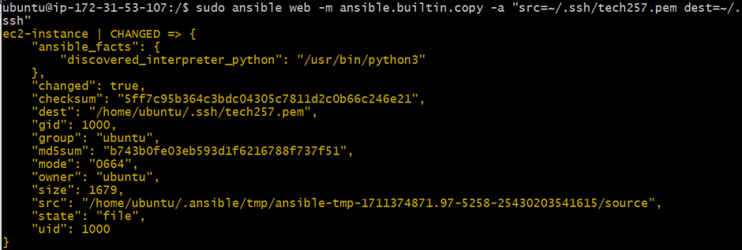
   - After executing the command, verify that the `tech257.pem` file is present on the agent node, indicating successful key transfer.
  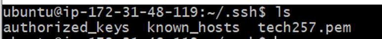

# Running Playbooks with Ansible

1. **Create and Run Playbook:**
   - Create a playbook in yaml that includes tasks to perform various actions, such as installing dependencies, cloning the app folder, and starting the application. Here we are just installing nginx on the agent node.
  
   - Run the playbook using Ansible to execute the tasks on the agent node with `sudo ansible-playbook <file_name.yaml>`
  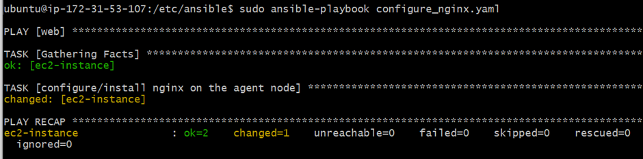

5. **Run the Playbook and Confirm Application Deployment:**
     - Execute the playbook to automate the deployment process.
    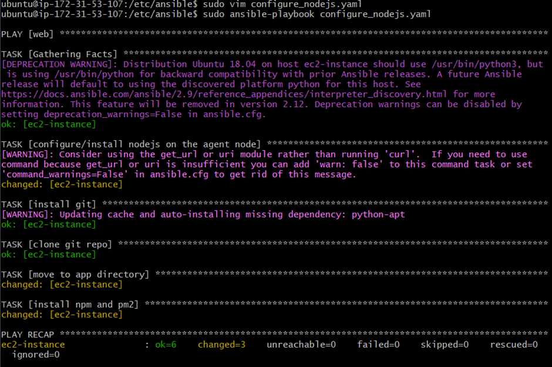
     - Verify that the application is running on the IP address, ensuring that port 3000 is opened.
    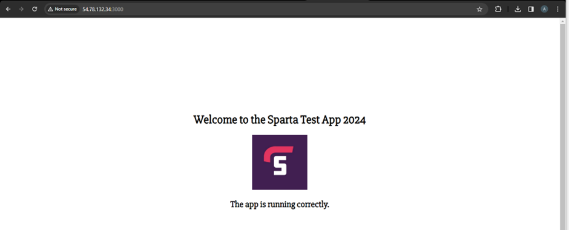

We have successfully deployed our application using ansible playbooks.

2. **Confirm Playbook Execution:**
   - After running the playbook, ensure that it executes without issues.
   - Use an adhoc command like `sudo ansible web -a "systemctl status nginx"` to verify that services are active and running as expected.
   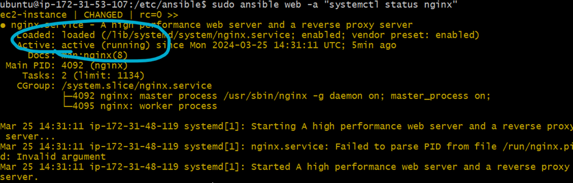

3. **Check IP:**
   - Open port 80 on the security group to access the default webpage from the application's public IP.
   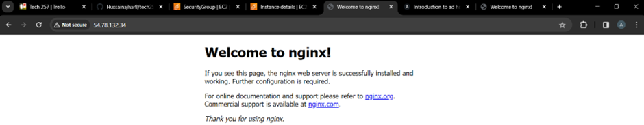

4. **Create a Playbook for Application Deployment:**
    - Tasks include:
      - Installing Node.js
      - Cloning the app folder
      - Installing npm and pm2
      - Starting the application
  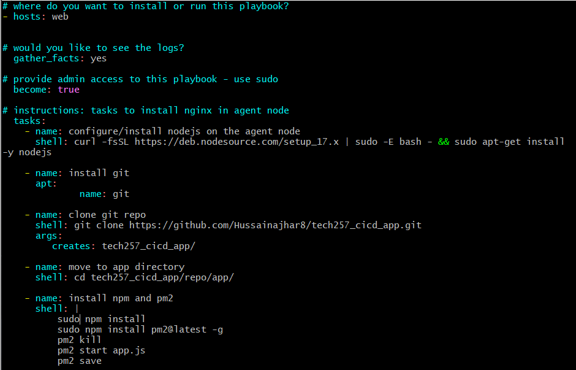

5. **Run the Playbook and Confirm Application Deployment:**

- Execute the playbook to automate the deployment process. 

- Verify that the application is running on the IP address, ensuring that port 3000 is opened. 

- We have successfully deployed our application using ansible playbooks.

## Deploying a database
1. **Deploying the Database and Manually configuring:**
   - Create an EC2 instance for the database, ensuring that port 27017 is open on the security group.
   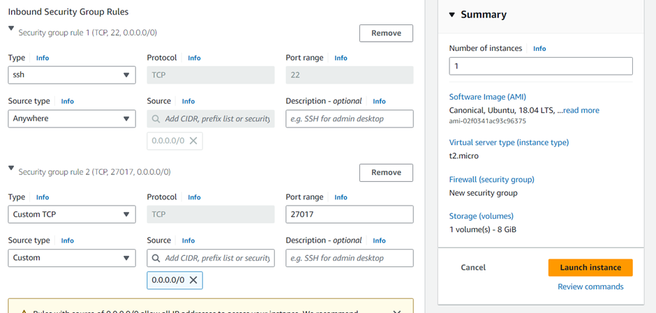
   - Edit the hosts file on the controller node to establish connections to both the application and database.
   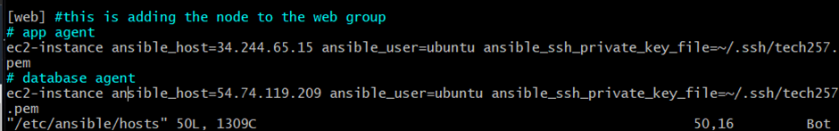
   - Ping all agents to confirm connectivity.
   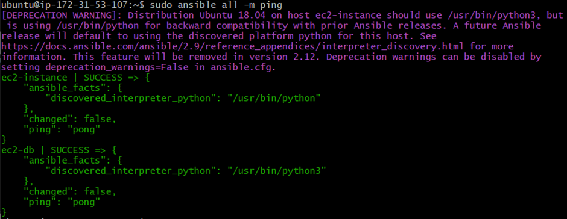
   - Create a playbook to install MongoDB.
   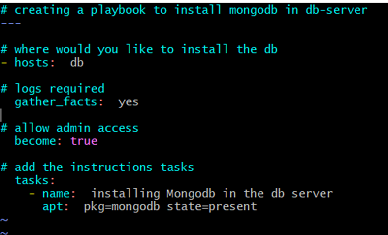
   - Run the playbook to install MongoDB on the database instance from the controller.
   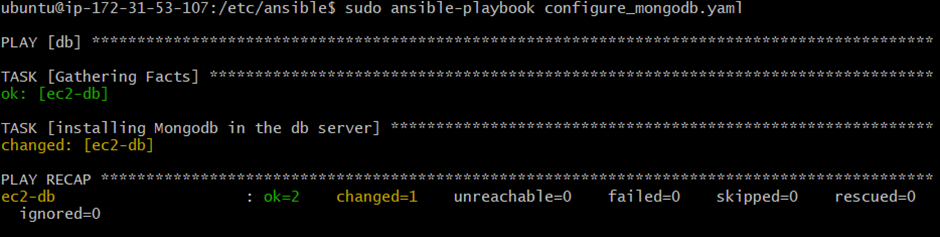
   - Modify the `/etc/mongodb.conf` file to change the bind IP and open the port.
   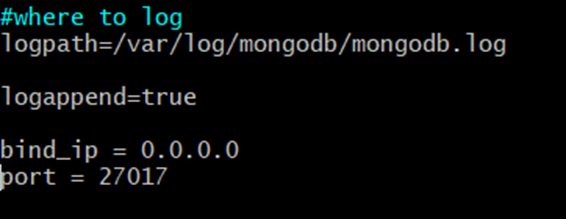
   - Restart MongoDB.
   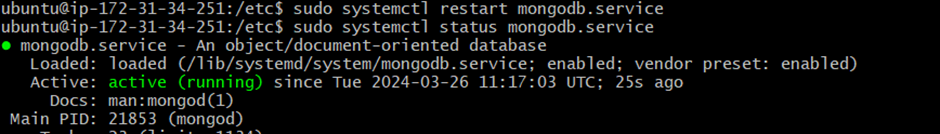
   - Export the environment variable in the application instance persistently by appending `export DB_HOST=mongodb://34.245.74.116:27017/posts` to the `~/.bashrc` file and sourcing it with `source ~/.bashrc`
   - Verify functionality when done manually.
   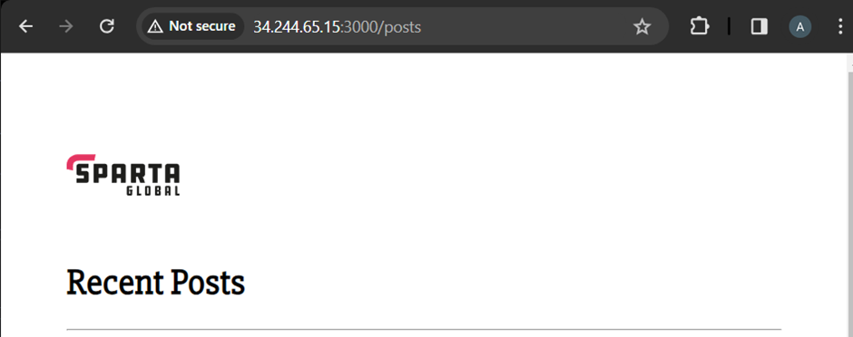
  
2. **Automating MongoDB Configuration:**
   - Update the `configure_mongodb.yaml` playbook to use a `sed` command to replace the necessary lines in the MongoDB configuration file and then restart MongoDB.
   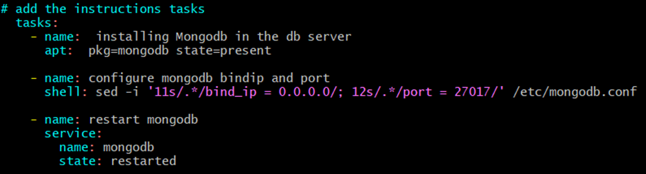
   - Run the updated playbook.
   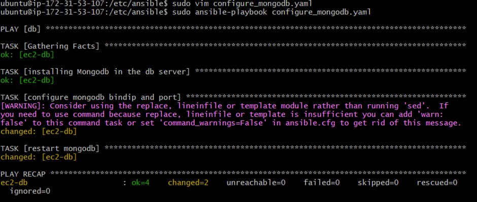
   - Confirm the changes by checking the MongoDB configuration file on the database instance and ensuring that MongoDB has restarted.
   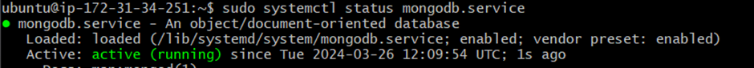
  
3. **Modifying the Application Configuration:**
   - Modify the `configure_nodejs.yaml` playbook to declare the `DB_HOST` variable before installing and starting the application.
   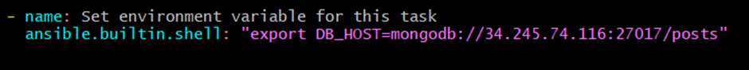
   - Run the playbook again.
   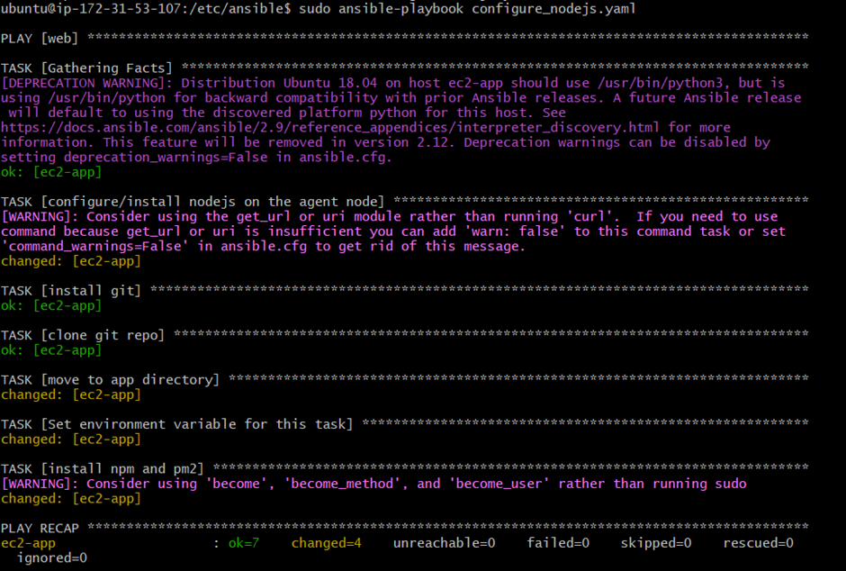
   - Verify that the application is functioning as expected and /posts is accessible.

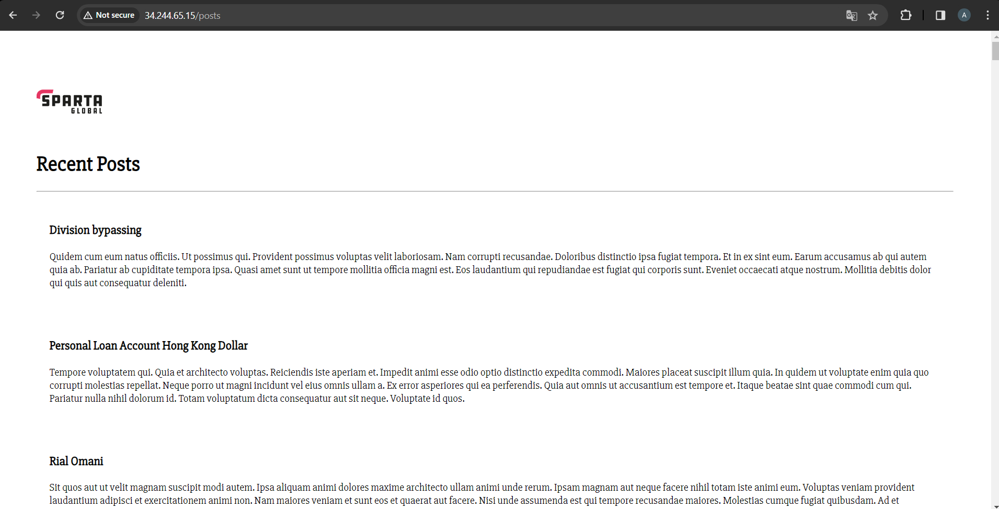

## Final playbooks
```bash
      # The configure_nginx.yaml file

      # yaml files starts with --- (three) dashes in legacy
      ---
      # where do you want to install or run this playbook?
      - hosts: web


      # would you like to see the logs?
      gather_facts: yes

      # provide admin access to this playbook - use sudo
      become: true

      # instructions: tasks to install nginx in agent node
      tasks:
      - name: configure/install nginx on the agent node
         apt: pkg=nginx state=present
```

```bash
      # The final configure_nodejs.yaml file   
      # where do you want to install or run this playbook?
      - hosts: web


      # would you like to see the logs?
      gather_facts: yes

      # provide admin access to this playbook - use sudo
      become: true

      # instructions: tasks to install nginx in agent node
      tasks:
         - name: configure/install nodejs on the agent node
            shell: curl -fsSL https://deb.nodesource.com/setup_17.x | sudo -E bash - && sudo apt-get install -y nodejs

         - name: install git
            apt:
                  name: git

         - name: clone git repo
            shell: git clone https://github.com/Hussainajhar8/tech257_cicd_app.git
            args:
               creates: tech257_cicd_app/

         - name: move to app directory
            shell: cd tech257_cicd_app/repo/app/

         - name: add a reverse proxy
            shell: sudo sed -i '51s/.*/                proxy_pass http:\/\/localhost:3000;/' /etc/nginx/sites-available/default

         - name: reload nginx
            shell: sudo systemctl reload nginx

            #- name: configure db_host
            #shell: |
            #   echo 'export DB_HOST=mongodb:// 34.245.74.116:27017/posts' >> ~/.bashrc
            #   source ~/.bashrc

         - name: Set environment variable for this task
            ansible.builtin.shell: "export DB_HOST=mongodb://34.245.74.116:27017/posts"

         - name: Seed the database
         shell: node seeds/seed.js

         - name: install npm and pm2
            shell: |
               sudo npm install
               sudo npm install pm2@latest -g
               pm2 kill
               pm2 start app.js
               pm2 save
```


```bash
# The final configure_mongodb.yaml file
# creating a playbook to install mongodb in db-server
---

# where would you like to install the db
- hosts:  db

# logs required
  gather_facts:  yes

# allow admin access
  become: true

# add the instructions tasks
  tasks:
    - name:  installing Mongodb in the db server
      apt:  pkg=mongodb state=present

    - name: configure mongodb bindip and port
      shell: sed -i '11s/.*/bind_ip = 0.0.0.0/; 12s/.*/port = 27017/' /etc/mongodb.conf

    - name: restart mongodb
      service:
        name: mongodb
        state: restarted

```