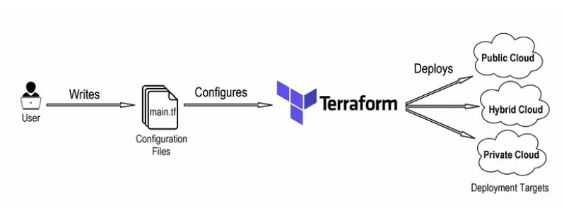
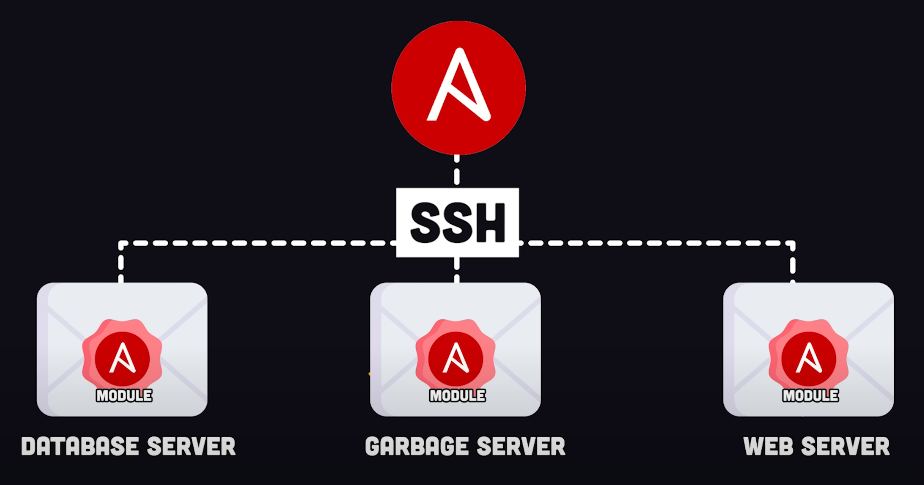
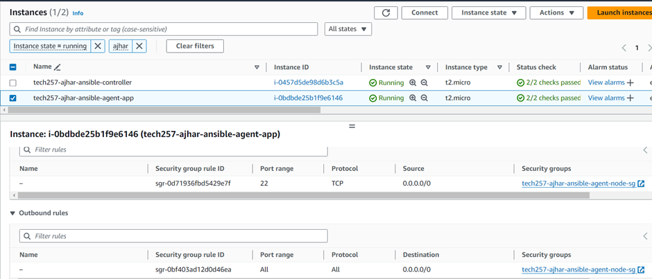
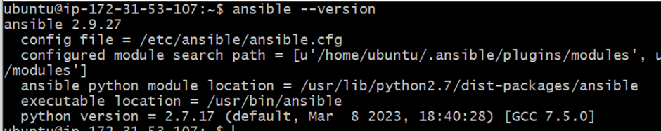
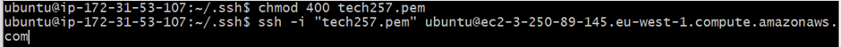
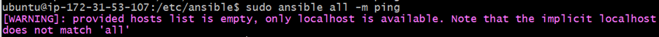
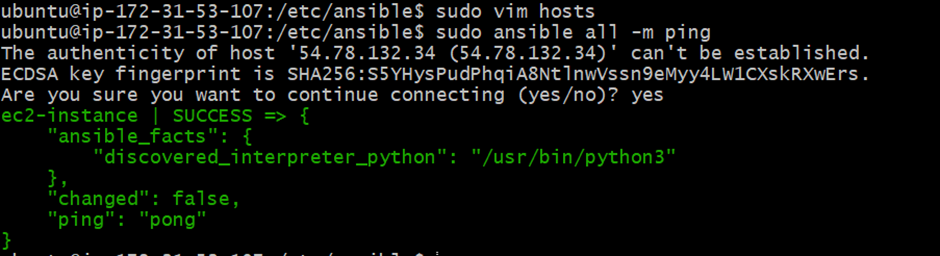
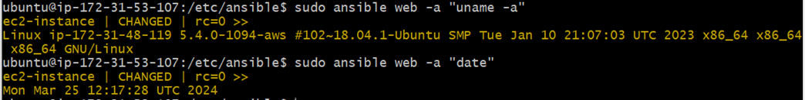
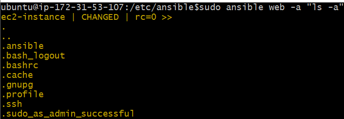

# Infrastructure as Code (IaC)

## What is it
Infrastructure as Code (IaC) means managing and provisioning infrastructure using code instead of manual processes, a common one is Terraform.

## Why should we use it
Using IaC ensures consistency, scalability, and faster deployments by automating infrastructure setup, this is because once you have the configurations file working you can recreate infrastructure by reusing them which is faster, avoids human error and can be automated further with cicd pipelines.


## When to use it
Use IaC when you need frequent deployments, dynamic environments, or large-scale infrastructure management.

## Where to use it
IaC can be used in cloud environments, on-premises data centers, and containerized environments.

## Tools available for IaC
Popular tools for IaC include Terraform, Ansible, AWS CloudFormation, Azure Resource Manager Templates, and Google Cloud Deployment Manager.

## What is Ansible and benefits
Ansible is an open-source automation tool for configuration management and deployment. It's agentless, uses a declarative language (YAML), and has a large community for support.


## Who is using IaC and Ansible in the industry
Companies like Netflix, NASA, Red Hat, Atlassian, and Walmart use IaC and Ansible for managing infrastructure and automating deployments.

# Setting up Ansible on AWS

To set up Ansible on AWS, follow these steps:

1. **Create EC2 Instances:**
   - Create two EC2 instances, one for the controller node and one for the agent node.
   - Allow access on port 22 in the security group to enable SSH access.
   

2. **Install Ansible on Controller Node:**
   - SSH into the controller node.
   - Run the following commands:
     ```bash
     sudo apt update -y
     sudo apt upgrade -y
     sudo apt install software-properties-common
     sudo apt-add-repository ppa:ansible/ansible
     sudo apt install ansible
     ```
   - Confirm Ansible installation by running `ansible --version`.
    

3. **Configure Agent Node:**
   - From the controller node, SSH into the agent node.
   - Ensure to have the PEM file of the agent node in the `.ssh/` directory.
   - Set appropriate permissions for the PEM file using `chmod 400 <pem_file>` to secure the key.
   - SSH into the agent node from the controller node.
   

4. **Check Agent Connection:**
   - Run `sudo ansible all -m ping` from the controller node to check if the agent is connected.
  
   - Since the host files are empty, it indicates the need to add the agent as a host in the Ansible hosts file.

5. **Update Hosts File:**
   - Edit the hosts file located in the `/etc/ansible` directory using `sudo vim hosts`.
   - Add the agent node as a host in the hosts file.
   

6. **Verify Connection:**
   - After updating the hosts file, rerun the ping command (`sudo ansible all -m ping`) to verify the successful connection between the controller and agent node.
   - A "pong" response indicates a successful connection.
   

7. **Execute Commands:**
   - Now, commands can be executed from the controller to the group (of agent nodes), such as the "web" group.
  
   - If we do an `ls -a to` the agent node we can see it has the `.ansible` directory which it received from the controller node presumably when we did the ping command.
  

